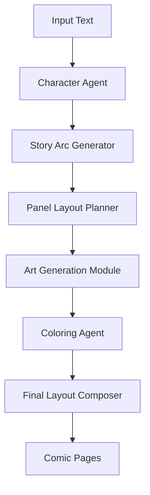

# Stylus - Automated Comic Book Design Workflow

[](https://github.com/albinks/stylus/actions)
[](https://github.com/albinks/stylus/releases)
[](https://albinks.github.io/stylus)
[](https://www.python.org/downloads/)
[](LICENSE)
[](https://github.com/psf/black)
[](https://conventionalcommits.org)

**Stylus** is an open-source Python library that streamlines the creation of comic books from news articles or custom prompts through AI-driven agents.

## 🎯 What is Stylus?

Transform text into polished comic books using a multi-agent AI pipeline:

- **Character Creation** → Generate consistent character profiles and visual attributes
- **Story Arc Generation** → Convert text into structured narrative with dialogue
- **Panel Layout Planning** → Design optimal comic page layouts
- **Art Generation** → Create line art using AI models like Stable Diffusion
- **Coloring** → Apply mood-based color schemes and shading
- **Final Composition** → Assemble panels, text, and assets into publication-ready pages

## 🚀 Quick Start

### Installation

```bash
# Install with Poetry (recommended)
poetry add stylus

# Or with pip
pip install stylus
```

### Basic Usage

```python
from stylus import ComicGenerator

# Generate a comic from text
generator = ComicGenerator()
comic = generator.create_comic(
    title="The Rise of the Phoenix",
    source="Breaking news article about urban renewal",
    style="neo-noir"
)

# Export to various formats
comic.export("my_comic.pdf")
comic.export_pages("pages/")  # Individual PNG files
```

## 🏗️ Architecture



## 🛠️ Development Setup

### Prerequisites

- **Python 3.12+** - Latest stable Python
- **Poetry** - For dependency management
- **Git** - For version control

### Project Initialization

1. **Clone the repository:**
   ```bash
   git clone https://github.com/albinks/stylus.git
   cd stylus
   ```

2. **Set up development environment:**
   ```bash
   make install
   ```
   This will:
   - Install Poetry dependencies (dev, docs, test groups)
   - Set up pre-commit hooks
   - Configure the development environment

3. **Verify installation:**
   ```bash
   make dev
   ```
   This runs formatting, linting, type checking, and tests.

### Development Workflow

```bash
# Format code
make format

# Run linting
make lint

# Type checking
make typecheck

# Run tests with coverage
make test

# Build and serve documentation
make docs

# Run all development checks
make dev

# Clean build artifacts
make clean
```

## 🔄 Versioning & Releases

Stylus uses **automated semantic versioning** based on [Conventional Commits](https://conventionalcommits.org/). This ensures consistent, predictable releases and automatically generated changelogs.

### Commit Message Format

All commits must follow the conventional commit format:

```
<type>[optional scope]: <description>

[optional body]

[optional footer(s)]
```

### Commit Types

| Type | Description | Version Bump |
|------|-------------|--------------|
| `feat` | New feature | **Minor** (0.1.0 → 0.2.0) |
| `fix` | Bug fix | **Patch** (0.1.0 → 0.1.1) |
| `feat!` or `fix!` | Breaking change | **Major** (0.1.0 → 1.0.0) |
| `docs` | Documentation only | No bump |
| `style` | Code style changes | No bump |
| `refactor` | Code refactoring | No bump |
| `test` | Adding tests | No bump |
| `chore` | Maintenance tasks | No bump |

### Examples

```bash
# Feature addition (minor version bump)
git commit -m "feat: add character generation agent with GPT-4 integration"

# Bug fix (patch version bump)
git commit -m "fix: resolve panel layout spacing issue in comic composer"

# Breaking change (major version bump)
git commit -m "feat!: redesign agent API interface for better modularity

BREAKING CHANGE: Agent.process() method signature changed from process(data) to process(context, data)"

# Documentation update (no version bump)
git commit -m "docs: update installation instructions for Poetry setup"

# Maintenance (no version bump)
git commit -m "chore: update dependencies to latest versions"
```

### Release Process

Releases are **fully automated** via GitHub Actions:

1. **Push to main** → Triggers release workflow
2. **Analyze commits** → Determines version bump type
3. **Update version** → Updates `pyproject.toml` and `stylus/__init__.py`
4. **Generate changelog** → Creates `CHANGELOG.md` from commit messages
5. **Create GitHub release** → Tags and publishes release notes
6. **Publish to PyPI** → Makes package available via `pip install`

### Manual Release Commands

For maintainers, these commands are available:

```bash
# Check what version would be bumped to
make version

# Preview changelog without releasing
make changelog

# Bump version locally (for testing)
make bump

# Create and publish release (use with caution)
make release
```

### Version Management

- **Current version** is stored in `pyproject.toml` and `stylus/__init__.py`
- **Semantic-release** automatically keeps both files in sync
- **Git tags** follow the format `v1.2.3`
- **GitHub releases** include auto-generated release notes
- **PyPI releases** are published automatically on successful releases

### Environment Variables

Create a `.env` file for local development:

```bash
# Copy the example environment file
cp .env.example .env

# Edit with your API keys
OPENAI_API_KEY=your_openai_key_here
STABILITY_API_KEY=your_stability_key_here
```

## 📚 Documentation

- **[Full Documentation](https://albinks.github.io/stylus)** - Complete guides and API reference
- **[Getting Started](https://albinks.github.io/stylus/getting-started/installation/)** - Installation and setup
- **[Architecture](https://albinks.github.io/stylus/architecture/overview/)** - System design and patterns
- **[API Reference](https://albinks.github.io/stylus/api/agents/)** - Complete API documentation
- **[Tutorials](https://albinks.github.io/stylus/tutorials/basic-usage/)** - Interactive examples

## 🎨 Features

### For Creators
- **Rapid Production**: Generate 4-6 page comics in under 10 minutes
- **No Artistic Skills Required**: Focus on storytelling, let AI handle visuals
- **Multiple Styles**: Neo-noir, manga, superhero, indie comics, and more
- **Iterative Refinement**: Easily modify and regenerate specific elements

### For Developers
- **Modular Design**: Replace or extend individual agents
- **Type-Safe**: Full Pydantic schemas for data validation
- **Extensible**: Plugin architecture for custom styles and models
- **Well-Tested**: Comprehensive test suite with 85%+ coverage

## 🎯 Use Cases

- **Digital Journalism** - Convert breaking news into engaging visual narratives
- **Independent Publishing** - Transform written stories into illustrated comics
- **Educational Content** - Create educational comics for complex topics
- **Content Marketing** - Generate unique visual content for social media

## 🤝 Contributing

Stylus is designed for community collaboration:

- **< 3k LOC** - Approachable codebase for contributors
- **Clear Architecture** - Well-documented patterns and interfaces
- **Quality Gates** - Automated testing and code quality checks
- **Hackathon-Friendly** - Perfect for AI/creative coding events

### Contributing Steps

1. **Fork the repository**
2. **Create a feature branch:** `git checkout -b feature/amazing-feature`
3. **Set up development environment:** `make install`
4. **Make your changes** following our [Code Style Guide](.clinerules)
5. **Run tests:** `make dev`
6. **Commit your changes using conventional commits:**
   ```bash
   git commit -m "feat: add amazing feature for comic generation"
   ```
7. **Push to the branch:** `git push origin feature/amazing-feature`
8. **Open a Pull Request**

**Important:** All commits must follow [Conventional Commits](https://conventionalcommits.org/) format. The pre-commit hooks will enforce this automatically.

See our [Contributing Guide](https://albinks.github.io/stylus/development/contributing/) for detailed information.

## 🛠️ Technology Stack

- **Python 3.12** - Latest stable Python with enhanced performance
- **Pydantic v2** - Type-safe data validation and serialization
- **FastAPI** - High-performance web API framework
- **OpenAI GPT-4** - Text generation for stories and dialogue
- **Stable Diffusion** - AI-powered art generation
- **NetworkX** - Graph-based story and panel relationship modeling

## 📄 License

This project is licensed under the MIT License - see the [LICENSE](LICENSE) file for details.

## 🙏 Acknowledgments

- **OpenAI** for GPT-4 and API access
- **Stability AI** for Stable Diffusion models
- **The Python Community** for excellent tooling and libraries
- **Comic Book Artists** for inspiration and creative guidance

---

**Ready to create your first comic?** Check out our [Quick Start Guide](https://albinks.github.io/stylus/getting-started/quickstart/) or explore the [Interactive Tutorials](https://albinks.github.io/stylus/tutorials/basic-usage/).
