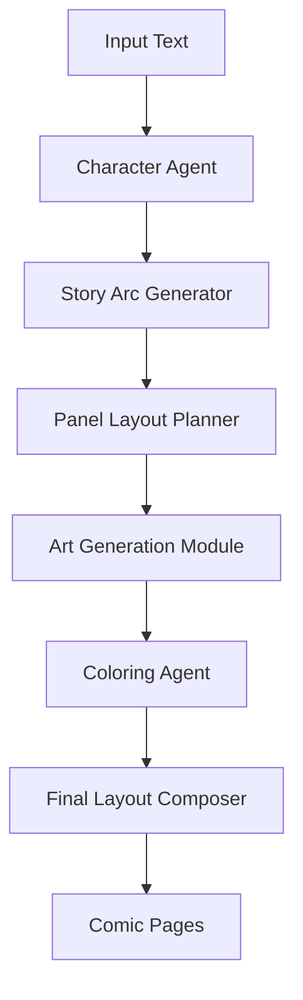

# Stylus - Automated Comic Book Design Workflow

[](https://github.com/albinks/stylus/actions)
[](https://albinks.github.io/stylus)
[](https://www.python.org/downloads/)
[](https://github.com/albinks/stylus/blob/main/LICENSE)

**Stylus** is an open-source Python library that streamlines the creation of comic books from news articles or custom prompts through AI-driven agents.

## 🎯 What is Stylus?

Stylus transforms text into polished comic books using a multi-agent AI pipeline. It integrates specialized agents for:

- **Character Creation** - Generate consistent character profiles and visual attributes
- **Story Arc Generation** - Convert text into structured narrative with dialogue
- **Panel Layout Planning** - Design optimal comic page layouts
- **Art Generation** - Create line art using AI models like Stable Diffusion
- **Coloring** - Apply mood-based color schemes and shading
- **Final Composition** - Assemble panels, text, and assets into publication-ready pages

## 🚀 Quick Start

```bash
# Install with Poetry (recommended)
poetry add stylus

# Or with pip
pip install stylus
```

```python
from stylus import ComicGenerator

# Generate a comic from text
generator = ComicGenerator()
comic = generator.create_comic(
    title="The Rise of the Phoenix",
    source="Breaking news article about urban renewal",
    style="neo-noir"
)

# Export to various formats
comic.export("my_comic.pdf")
comic.export_pages("pages/")  # Individual PNG files
```

## 🏗️ Architecture

Stylus uses a **sequential agent architecture** where specialized AI agents handle distinct phases:



Each agent maintains **narrative coherence** and **visual consistency** through shared context management.

## 🎨 Key Features

### For Creators
- **Rapid Production**: Generate 4-6 page comics in under 10 minutes
- **No Artistic Skills Required**: Focus on storytelling, let AI handle visuals
- **Multiple Styles**: Neo-noir, manga, superhero, indie comics, and more
- **Iterative Refinement**: Easily modify and regenerate specific elements

### For Developers
- **Modular Design**: Replace or extend individual agents
- **Type-Safe**: Full Pydantic schemas for data validation
- **Extensible**: Plugin architecture for custom styles and models
- **Well-Tested**: Comprehensive test suite with 85%+ coverage

## 🎯 Use Cases

### Digital Journalism
Convert breaking news into engaging visual narratives for social media and online publications.

### Independent Publishing
Transform written stories into illustrated comics without hiring professional artists.

### Educational Content
Create educational comics to make complex topics more accessible and engaging.

### Content Marketing
Generate unique visual content that stands out in crowded social media feeds.

## 🛠️ Technology Stack

- **Python 3.12** - Latest stable Python with enhanced performance
- **Pydantic v2** - Type-safe data validation and serialization
- **FastAPI** - High-performance web API framework
- **OpenAI GPT-4** - Text generation for stories and dialogue
- **Stable Diffusion** - AI-powered art generation
- **NetworkX** - Graph-based story and panel relationship modeling

## 📚 Documentation

- [**Getting Started**](getting-started/installation.md) - Installation and setup
- [**Architecture**](architecture/overview.md) - System design and patterns
- [**API Reference**](api/agents.md) - Complete API documentation
- [**Tutorials**](tutorials/basic-usage.ipynb) - Interactive examples
- [**Development**](development/contributing.md) - Contributing guidelines

## 🤝 Contributing

Stylus is designed for community collaboration with:

- **< 3k LOC** - Approachable codebase for contributors
- **Clear Architecture** - Well-documented patterns and interfaces
- **Quality Gates** - Automated testing and code quality checks
- **Hackathon-Friendly** - Perfect for AI/creative coding events

See our [Contributing Guide](development/contributing.md) to get started.

## 📄 License

Stylus is released under the [MIT License](https://github.com/albinks/stylus/blob/main/LICENSE), encouraging both open-source collaboration and commercial use.

---

**Ready to create your first comic?** Check out our [Quick Start Guide](getting-started/quickstart.md) or explore the [Interactive Tutorials](tutorials/basic-usage.ipynb).
