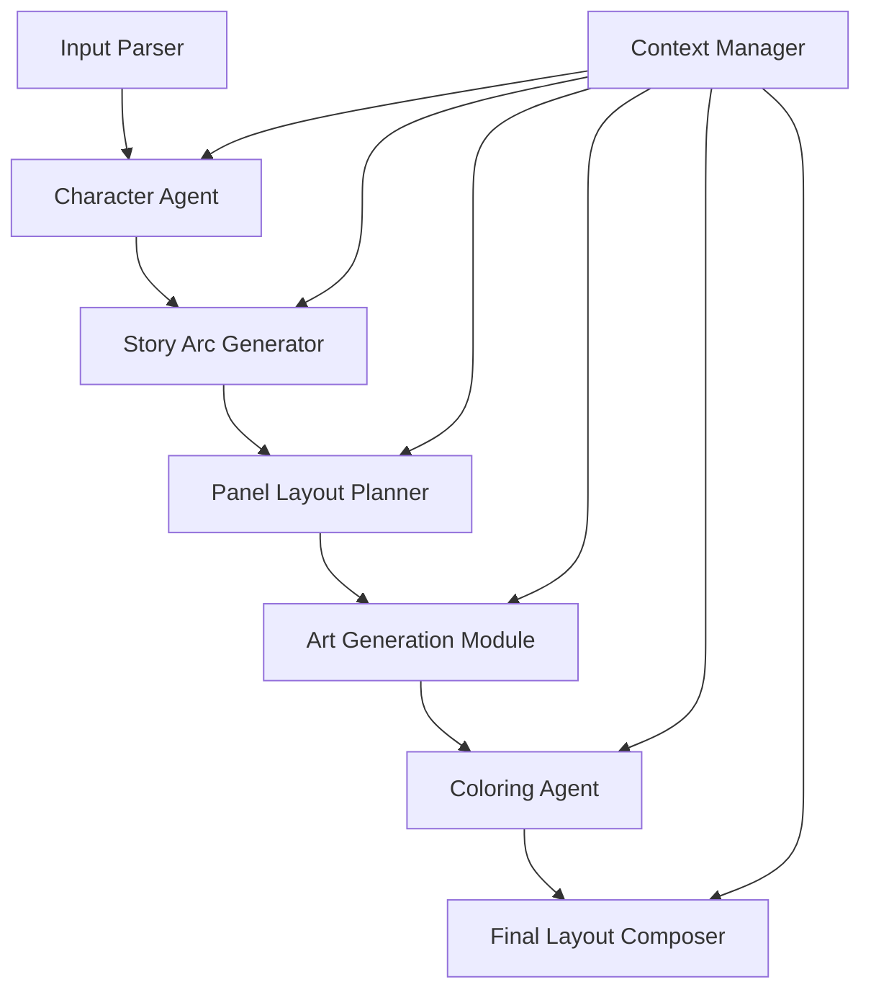

# System Patterns: Stylus

## Architecture Overview

### Multi-Agent Pipeline Pattern
Stylus follows a **sequential agent architecture** where specialized AI agents handle distinct phases of comic creation:

```
Input → Character Agent → Story Agent → Layout Agent → Art Agent → Color Agent → Composer → Output
```

Each agent maintains **state consistency** through shared data schemas and **narrative coherence** through context passing.

## Core Design Patterns

### 1. Agent-Based Workflow Pattern
**Pattern**: Each major function is encapsulated in a specialized agent class
**Benefits**:
- Clear separation of concerns
- Easy to test and debug individual components
- Modular replacement of agents
- Parallel processing opportunities

```python
class BaseAgent:
    def process(self, input_data: Dict, context: Context) -> AgentOutput:
        # Standard agent interface
        pass

class CharacterAgent(BaseAgent):
    def process(self, story_input: Dict, context: Context) -> CharacterOutput:
        # Generate character profiles and visual attributes
        pass
```

### 2. Schema-Driven Data Flow
**Pattern**: All inter-agent communication uses Pydantic schemas
**Benefits**:
- Type safety and validation
- Clear data contracts
- Easy serialization/deserialization
- Self-documenting APIs

```python
class CharacterSchema(BaseModel):
    name: str
    visual_attributes: Dict[str, Any]
    personality_traits: List[str]
    role: CharacterRole

class StoryArcSchema(BaseModel):
    scenes: List[SceneSchema]
    characters: List[CharacterSchema]
    narrative_flow: NarrativeStructure
```

### 3. Context Preservation Pattern
**Pattern**: Shared context object maintains consistency across agents
**Benefits**:
- Character consistency across panels
- Style coherence throughout comic
- Narrative continuity

```python
class ComicContext:
    characters: Dict[str, CharacterSchema]
    style_guide: StyleSchema
    narrative_state: NarrativeState
    visual_consistency: VisualTracker
```

## Component Relationships

### Data Flow Architecture


### Agent Dependencies
- **Character Agent**: Independent, creates foundation
- **Story Agent**: Depends on character profiles
- **Layout Agent**: Depends on story structure
- **Art Agent**: Depends on characters + layout
- **Color Agent**: Depends on art + style context
- **Composer**: Depends on all previous outputs

## Critical Implementation Paths

### 1. Character Consistency Pipeline
**Challenge**: Maintain visual character consistency across panels
**Solution**:
- Character embedding vectors stored in context
- Visual attribute templates for each character
- Consistency validation between art generations

### 2. Narrative Coherence System
**Challenge**: Ensure story flows logically across panels
**Solution**:
- Scene transition validation
- Dialogue continuity checking
- Narrative arc completion verification

### 3. Style Transfer Coordination
**Challenge**: Maintain consistent art style throughout comic
**Solution**:
- Global style embedding shared across agents
- Style validation checkpoints
- Fallback style correction mechanisms

## Error Handling Patterns

### 1. Graceful Degradation
- If advanced AI model fails, fallback to simpler alternatives
- Partial generation with user intervention points
- Quality thresholds with retry mechanisms

### 2. Validation Gates
- Schema validation between each agent
- Content quality checks before proceeding
- User approval checkpoints for critical decisions

### 3. Recovery Strategies
- Checkpoint system for long-running generations
- Partial result caching
- Resume-from-failure capabilities

## Performance Patterns

### 1. Lazy Loading
- Generate content only when needed
- Cache expensive operations
- Stream results for immediate feedback

### 2. Batch Processing
- Group similar operations (multiple character generations)
- Optimize API calls to external services
- Parallel processing where possible

### 3. Resource Management
- GPU memory management for art generation
- API rate limit handling
- Compute budget allocation across agents

## Integration Patterns

### 1. Plugin Architecture
- Extensible agent system
- Custom style plugins
- Third-party AI model integration

### 2. Configuration Management
- Environment-specific settings
- User preference persistence
- Model parameter tuning

### 3. Export Pipeline
- Multiple output format support
- Quality optimization for different targets
- Metadata preservation

## Quality Assurance Patterns

### 1. Automated Testing
- Unit tests for each agent
- Integration tests for full pipeline
- Visual regression testing for art output

### 2. Human-in-the-Loop
- Review checkpoints at key stages
- User feedback integration
- Manual override capabilities

### 3. Continuous Validation
- Real-time quality metrics
- Performance monitoring
- User satisfaction tracking

This architecture ensures **scalability**, **maintainability**, and **extensibility** while keeping the codebase under the 3k LOC constraint through focused, single-responsibility components.
